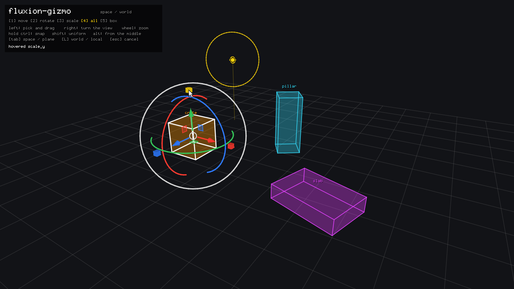
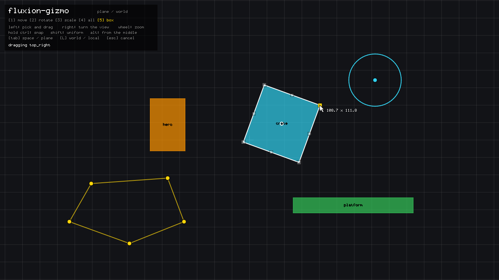

# Fluxion Gizmo

Handles in a picture for the pointer to drag - arrows, rings and boxes that
move, turn and scale things, in 2D and in 3D - drawn with
[Fluxion Debug Draw](https://github.com/kisstp2006/fluxion-debugdraw). For
Zig 0.16.

| | |
| --- | --- |
|  |  |
| <sub>`transform` with `.tool = .all`: arrows, planes, rings and scale cubes</sub> | <sub>`bounds2d`, mid-drag: the far corner stays, the size is written beside the pointer</sub> |

| Module | What it is |
| --- | --- |
| `Gizmo` | One per view: begins and ends a frame, draws the handles and drags them. |
| `Camera` | What a gizmo reads from the view-projection: a point's pixel, a pixel's ray, and how much world one pixel covers. |
| `Pose2D` | A position, an angle and a scale on a plane, `y` down, as a 2D editor keeps them. |

```zig
const gizmos = @import("fluxion_gizmo");

var gizmo: gizmos.Gizmo = .{};

// Every frame:
gizmo.begin(.{
    .pen = overlay.pen(),
    .view_projection = camera,
    .clip = device.clip(),
    .width = 1280,
    .height = 720,
    .pointer = mouse,               // pixels from the top left of the view
    .down = left_button,
    .snap = ctrl,
    .cancel = escape,
});
var pose: gizmos.Pose2D = .{ .position = .init(t.x, t.y), .rotation = t.rotation, .scale = .init(t.scale_x, t.scale_y) };
const moved = gizmo.transform2d(.of(entity), &pose, .{ .tool = .rotate, .snap = .{ .rotate = std.math.pi / 12.0 } });
if (moved.changed) write(pose);
if (moved.phase == .finished) history.seal();
gizmo.end();

if (!gizmo.wantsPointer()) pickWithTheMouse();
```

Six decisions run through it:

**Immediate mode.** There is nothing to register and nothing to remove: a
gizmo exists in the frames it is drawn in, for a value the caller owns. Its
`Id` - any value, hashed: an entity, a name, both - is how it is known from
one frame to the next, and the `Gizmo` keeps only what the pointer is over
and what it is dragging.

**A drag is worked out from where it started.** Every frame the value is what
it was at the press, changed by all the pointer has done since - never last
frame's value nudged again. Nothing drifts, a snapped value lands exactly on
its step, a ring turned twice round is two turns, and cancelling is writing
the first value back.

**The phases are for undo.** A response says `started` the frame after the
press, with the value not yet touched, so it can be kept; `dragging` while
`changed` says whether it was written; `finished` when the button is let go;
`cancelled` when `Frame.cancel` put it back. A quick click can finish without
having started.

**Sizes are pixels.** A gizmo is as big on the screen however far away or
zoomed out it is, which it works out from the view-projection at the point it
stands on. That matrix is all it knows of the camera, so a perspective one,
an orthographic one and fluxion-engine's `y`-down 2D view need no telling
apart.

**2D is 3D seen face on.** `transform2d` is `transform` with the plane's
arrows, one ring and its scale handles. Solids are drawn flat there: a 2D
camera may keep nothing but the plane, and a cone standing off it would be
cut away by the near and far planes.

**It draws with a pen, over everything.** Lines and fills go into the world
through the same view-projection as the scene, never depth tested; the few
things that face the viewer - the middle disc, a box's corners, what a drag
has done - go into the pen's screen space. Call a gizmo before drawing what
it moves, so that is drawn where the gizmo left it this frame, and give it a
pen on a canvas the renderer draws after the scene's.

## What the pointer is over

Every handle measures how far the pointer is from it, in pixels, and the
nearest within `Style.reach` wins - with small handles beating the lines
through them, lines beating the areas they border, and areas beating the
zone round a box's corners, so a box's edge can be grabbed from just inside
it. A press starts the drag of whatever won that frame. After `end`,
`wantsPointer` says the pointer is on a handle or dragging one: a view that
also picks with the mouse leaves that press alone. `Frame.hover = false`
keeps anything new from starting while the pointer is over something else,
and a drag already going carries on.

## The tools

| | 3D | 2D |
| --- | --- | --- |
| Move, rotate, scale, or all three | `transform(id, *math.Transform, options)` | `transform2d(id, *Pose2D, options)` |
| A box's sides, corners, inside and outside | | `bounds2d(id, *Pose2D, rect, options)` |
| A point, across a plane | `point(id, *Vec3, options)` | `point2d(id, *Vec2, options)` |
| A point, along a line | `slider(id, *Vec3, direction, options)` | |
| A radius | `radius(id, *f32, center, normal, options)` | `radius2d(id, *f32, center, options)` |

`Options` picks the `tool` - `.move`, `.rotate`, `.scale` or `.all` - the
`space` the arrows and rings follow, `.world` or `.local`, the `snap` steps,
and the `axes` that may be used; scaling always follows the thing's own axes.
A moving gizmo has an arrow per axis, a square per plane and a disc that
moves across the view; a turning one a ring per axis, the half of it that
faces the camera, and an outer ring that turns about the view; a scaling one
a cube per axis and a square that scales all of them.

`bounds2d` is a 2D editor's rectangle tool, on a `Rect` in the pose's own
space - `Rect.sized(size, pivot)` is a sprite's. A side or a corner resizes
it with the opposite side held still, the inside moves it, and just outside
a corner turns it about the pose's position. The handles are made for tools
of one's own: a collider's radius, a path's points, a light's reach.

The whole value is the world's. A thing with a parent is edited as its world
pose and written back into its parent's space by the caller.

## Snapping and the other keys

`Frame.snap` rounds what a drag has done to the steps in `Options.snap` -
world units for moving, radians for turning, a fraction for scaling - counted
from where the drag started. `Frame.uniform` scales every axis together and
keeps a box's proportions; `Frame.centered` grows a box about its middle.
Which keys those are is the program's business.

## Style

`gizmo.style` holds the size in pixels, the line width, how near is near
enough, the three axis colours - red, green and blue, as `Pen.axes` draws
them - the hovered colour, how faint the rest of a gizmo goes while one part
of it is dragged, and whether a drag's readout is written beside the pointer.

## Install

```bash
zig fetch --save git+https://github.com/kisstp2006/fluxion-gizmo
```

```zig
const gizmo = b.dependency("fluxion_gizmo", .{ .target = target, .optimize = optimize });
exe_mod.addImport("fluxion_gizmo", gizmo.module("fluxion_gizmo"));
```

[Fluxion Math](https://github.com/kisstp2006/fluxion-math) and Fluxion Debug
Draw come with it, pinned to the commits fluxion-engine pins, and Debug Draw
is asked for with the engine's own arguments: a program that has both gets
one copy of each, so the engine's `app.debug` is a pen the gizmo takes. The
example alone uses [Fluxion RHI](https://github.com/kisstp2006/fluxion-rhi),
[Fluxion Shader](https://github.com/kisstp2006/fluxion-shader),
[Fluxion Platform](https://github.com/kisstp2006/fluxion-platform) and
[Fluxion Image](https://github.com/kisstp2006/fluxion-image), each `lazy`.

## The example

```bash
zig build example                     # Direct3D on Windows, OpenGL elsewhere
zig build example -- --backend gl
zig build example -- --capture plane.png --scene plane --tool box --pointer 767,298 --drag 820,270
```

Three crates in space and three cards on a plane. Click one to pick it and
drag its gizmo; <kbd>1</kbd> to <kbd>5</kbd> or <kbd>W</kbd> <kbd>E</kbd>
<kbd>R</kbd> <kbd>T</kbd> <kbd>Y</kbd> choose move, rotate, scale, all and
the box; <kbd>L</kbd> switches world and local; <kbd>Tab</kbd> switches the
scenes; hold <kbd>Ctrl</kbd> to snap, <kbd>Shift</kbd> for uniform and
<kbd>Alt</kbd> for from the middle; <kbd>Esc</kbd> or the right button
cancels a drag. A lamp in space has a slider and a reach; on the plane a
ring has a middle and a radius, and a fence has five points. `--capture`
draws the moment after hovering `--pointer` - or pressing there and dragging
to `--drag` - into a PNG with no window shown, the pointer drawn in; the
pictures above are that.

## Tests

`zig build test` runs the library's suite with no window and no GPU: frames
are scripted - a pointer, a button - against a canvas, and what they did to
a value is checked. Every tool and handle is dragged, in space or on a plane,
by what the pointer crossed, with snapping, uniform and centred; a ring counts past half
a turn; a cancel puts the value back and a held button starts nothing new; a
press on nothing starts nothing; the nearer of two handles wins and a box's
edge wins over its inside; an axis pointing at the camera is not drawn, and
on a plane nothing leaves the plane. Every rule named there was checked by
breaking it: each of 24 planted bugs fails the suite. The camera is held to
itself across OpenGL, Direct3D and Vulkan conventions, the library is built
for `wasm32-freestanding`, and the example's own tests draw every scene and
tool through the renderer on the `none` backend and drag a crate through the
demo's input.

## What is not here

- **Turning freely.** No trackball inside the rings; a turn is about an axis
  or about the view.
- **A view cube.** The corner widget that shows and snaps the camera's
  direction.
- **A box in space.** `bounds2d` is flat; a 3D one would resize a volume by
  its faces.
- **Many at once.** One gizmo moves one value. A selection of several wants
  a pivot of its own and the gizmo on that.
- **Snapping to a grid.** Steps count from where the drag began, so a value
  that starts off the grid stays off it by as much.
- **Touch.** One pointer, one button.

## Licence

BSD-2-Clause, the third rung of [the ladder](../licensing/README.md), beside
fluxion-debugdraw, which it draws with.
